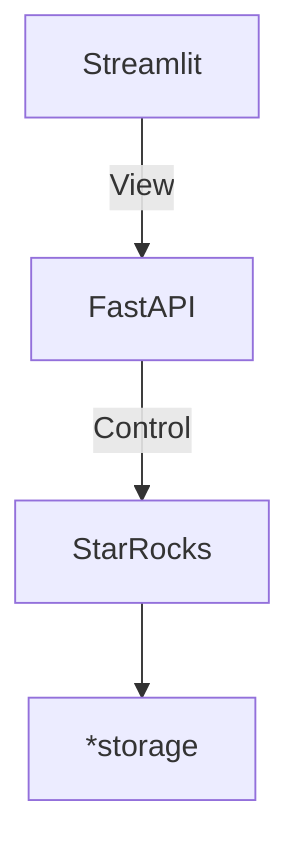
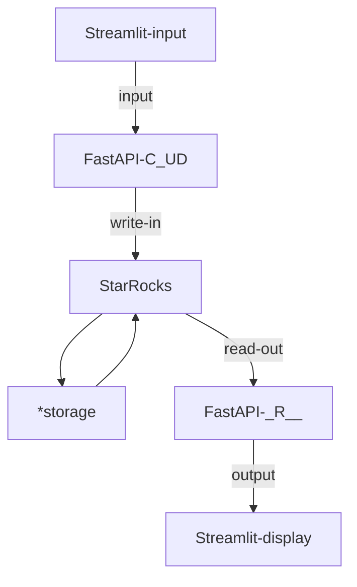

# LitePolis
Infrastructure for E-democracy  
 

Polis is a real-time system for gathering, analyzing and understanding
what large groups of people think in their own words,
enabled by advanced statistics and machine learning.

LitePolis is a Python-based, developer-friendly iteration of [Polis](https://github.com/compdemocracy/polis),
designed to provide a scalable and flexible platform for data scientists and developers.
Our goal is to make it easy to build and deploy data-driven applications with ease.

**Overview**

LitePolis is a refactored version of [Polis](https://github.com/compdemocracy/polis),
built using Python and optimized for scalability and performance.
We've incorporated a data lakehouse using [StarRocks](https://www.starrocks.io/),
a powerful and scalable analytics engine,
and adopted a Model-View-Controller
([MVC architecture](https://en.wikipedia.org/wiki/Model%E2%80%93view%E2%80%93controller))
architecture to ensure seamless integration and flexibility.

**Scalability at its Core**

Our MVC architecture enables horizontal scaling at all three levels,
making it easy to add new features and support large-scale applications:

* **Controller**: Scale your application by developing and distributing client-side web or mobile applications using our RESTful API.
* **View**: Scale your views by horizontally scaling Docker instances and adding load balancing to your infrastructure.
* **Model**: Scale your data processing by adjusting the number of StarRocks instances using [Kubernetes](https://github.com/StarRocks/starrocks-kubernetes-operator/tree/main/examples/starrocks) on cloud infrastructure.

This flexible architecture allows you to focus on building your application, while we handle the scalability and performance.

## Features

* [ ] **Real-time Sentiment Gathering:** Polis gathers and analyzes opinions from large groups of people in real-time.
* [ ] **Open-Ended Feedback:** Participants can express their views in their own words, going beyond simple surveys or polls.
* [ ] **Anonymous Participation:** Participants can contribute anonymously, fostering open and honest dialogue.
* [ ] **Voting Mechanism:** Participants can vote on statements submitted by others, indicating agreement, disagreement, or neutrality.
* [ ] **Advanced Statistical Analysis:** Polis uses machine learning algorithms to identify consensus statements, divisive statements, and patterns in opinions.
* [ ] **Data Visualization and Reporting:** The platform provides real-time data visualization and reporting tools to understand the results of the conversation.
* [ ] **Moderation Tools:** Moderators can manage the conversation, address spam, and ensure a productive environment.
* [ ] **Scalability:** The platform can handle large-scale conversations with many participants.

**Core Functionality:**

* **User Interface:**
    * [ ] User registration and authentication.
    * [ ] Interface for creating and joining conversations.
    * [ ] Interface for submitting statements and voting on them.
    * [ ] Interface for viewing conversation data and reports.
    * [ ] User-friendly and intuitive design.
* **Backend System:**
    * [ ] Database to store user data, conversation data, and voting data.
    * [x] API for interacting with the frontend and other services.
    * [ ] Secure and reliable infrastructure.
    * [x] Scalable architecture to handle large volumes of data and users.
* **Machine Learning Algorithms:**
    * [ ] Algorithms to analyze sentiment and identify consensus and divisive statements.
    * [ ] Algorithms to personalize the user experience based on their voting history and interests.
    * [ ] Algorithms to detect spam and inappropriate content.
* **Data Visualization and Reporting:**
    * [ ] Real-time visualizations of conversation data, including sentiment trends, agreement maps, and key statements.
    * [ ] Customizable reports and dashboards for analyzing data.
    * [ ] Ability to export data in various formats.
* **Moderation Tools:**
    * [ ] Tools for managing user accounts and roles.
    * [ ] Tools for flagging and removing inappropriate content.
    * [ ] Tools for moderating discussions and resolving conflicts.
* **Integration with Third-Party Services:**
    * [ ] Integration with translation services for multilingual conversations.
    * [ ] Integration with spam filtering services to prevent abuse.
    * [ ] Integration with other platforms and tools for data analysis and visualization.
* **Security:**
    * [ ] Compliance with relevant privacy regulations (e.g., GDPR).
* **Scalability:**
    * [x] Ability to handle large numbers of users and conversations.
    * [x] Scalable infrastructure to accommodate increasing demand.
    * [ ] Performance optimization for efficient data processing.
* **Accessibility:**
    * [ ] Accessible design for users with disabilities.
    * [ ] Support for multiple languages and cultural contexts.
* **Documentation:**
    * [ ] Comprehensive documentation for developers and users.
    * [ ] Tutorials and guides to help users understand the platform.
* **Testing:**
    * [ ] Thorough testing of all features and functionality.
    * [x] Automated testing to ensure code quality and stability.

## Getting started
Under development...
<!-- something about deployment and configuration -->
### Tryout
use all in one dockerfile
## Advanced usage
### Separate storage
https://www.starrocks.io/blog/four-simple-ways-to-deploy-starrocks
### Separate front end
disable `streamlit`
develop your own front end web/mobile/desktop application with RESTful API docs
### Product deployment
- MVC architecture
- Data lakehouse
  - https://www.starrocks.io/blog/four-simple-ways-to-deploy-starrocks
- scaling
  - scaling of UI
  - scaling of API server
  - scaling of database

## Developer manual
### Tech stack
Relationship of containers

Data flows from UI to API and store in database
then been accessed by other UI widget through other API endpoints

*storage: Such as Amazon S3, Google Cloud Storage, Azure Blob Storage, and other S3-compatible storage

Access control is provided by `Streamlit-Authenticator`
The flow and vulnerability of streamlit-Auth

### Detailed docs
- [API docs](https://github.com/NewJerseyStyle/LitePolis/tree/release/doc/api)
- [data dictionary](doc/database.md)
