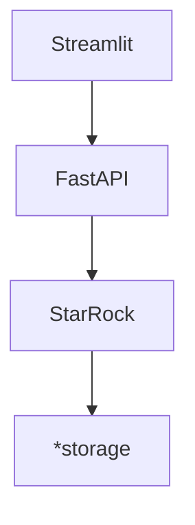

# LitePolis
 

Python port of [polis](https://github.com/compdemocracy/polis)
try to be data scientist friendly and easy to deploy
support horizontal scaling on cloud

## Getting started
Under development...
<!-- something about deployment and configuration -->
### Tryout
use all in one dockerfile
## Advanced usage
### Separate storage
https://www.starrocks.io/blog/four-simple-ways-to-deploy-starrocks
### Separate front end
disable `streamlit`
develop your own front end web/mobile/desktop application with RESTful API docs
### Product deployment
- MVC architecture
- Data lakehouse
  - https://www.starrocks.io/blog/four-simple-ways-to-deploy-starrocks
- scaling
  - scaling of UI
  - scaling of API server
  - scaling of database

## Developer manual
### Tech stack
Relationship of containers

*storage: Such as Amazon S3, Google Cloud Storage, Azure Blob Storage, and other S3-compatible storage

Access control is provided by `Streamlit-Authenticator`
The flow and vulnerability of streamlit-Auth

### API docs
### data dictionary
