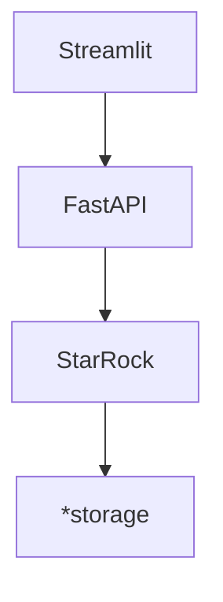

# LitePolis: Infrastructure for E-democracy
 

Polis is a real-time system for gathering, analyzing and understanding
what large groups of people think in their own words,
enabled by advanced statistics and machine learning.

LitePolis aim to provide a developer friendly version of Polis.

LitePolis is a code refactoring Python port of [polis](https://github.com/compdemocracy/polis)
but data scientist friendly with data lakehouse included using [StarRocks](https://www.starrocks.io/)
and build in [MVC architecture](https://en.wikipedia.org/wiki/Model%E2%80%93view%E2%80%93controller)
to ensure easy to deploy with support horizontal scaling on cloud
at all three levels of the MVC architecture.

- Scaling on `controller` by develop and distribute front end client side web application
  or mobile application with our RESTful API.
- Scaling on `view` by horizontal scaling the docker instances and adding load balancing
  in the infrastructure.
- Scaling on `model` by change the number of `StarRocks` instances
  [Kubernetes](https://github.com/StarRocks/starrocks-kubernetes-operator/tree/main/examples/starrocks) on cloud.

> The design of LitePolis based on the feature `commit/85ce00f2277b19c2c105d9b84408e1dfde097360` of Polis
> and the developer experience feedback from Civic Tech Toronto, plus user feedback and requirements collected
> by the folks in Civic Tech Toronto.

## Getting started
Under development...
<!-- something about deployment and configuration -->
### Tryout
use all in one dockerfile
## Advanced usage
### Separate storage
https://www.starrocks.io/blog/four-simple-ways-to-deploy-starrocks
### Separate front end
disable `streamlit`
develop your own front end web/mobile/desktop application with RESTful API docs
### Product deployment
- MVC architecture
- Data lakehouse
  - https://www.starrocks.io/blog/four-simple-ways-to-deploy-starrocks
- scaling
  - scaling of UI
  - scaling of API server
  - scaling of database

## Developer manual
### Tech stack
Relationship of containers

*storage: Such as Amazon S3, Google Cloud Storage, Azure Blob Storage, and other S3-compatible storage

Access control is provided by `Streamlit-Authenticator`
The flow and vulnerability of streamlit-Auth

### API docs
### data dictionary
