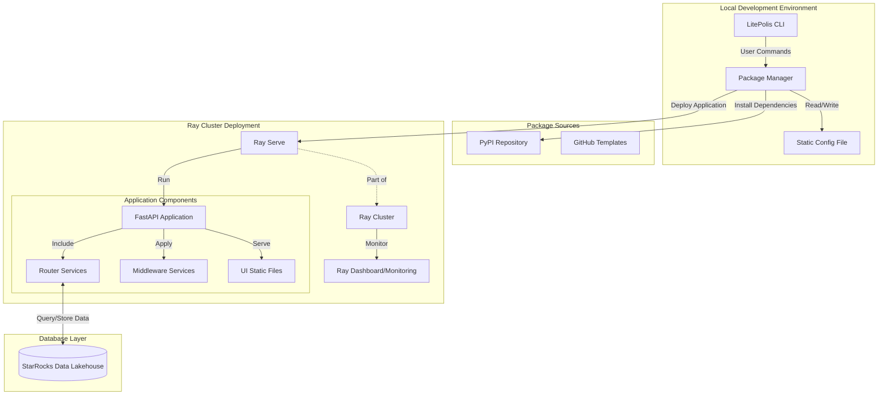
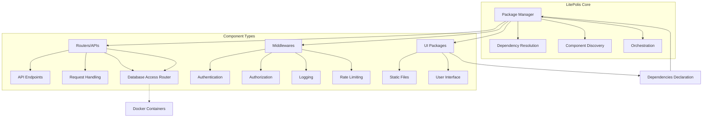
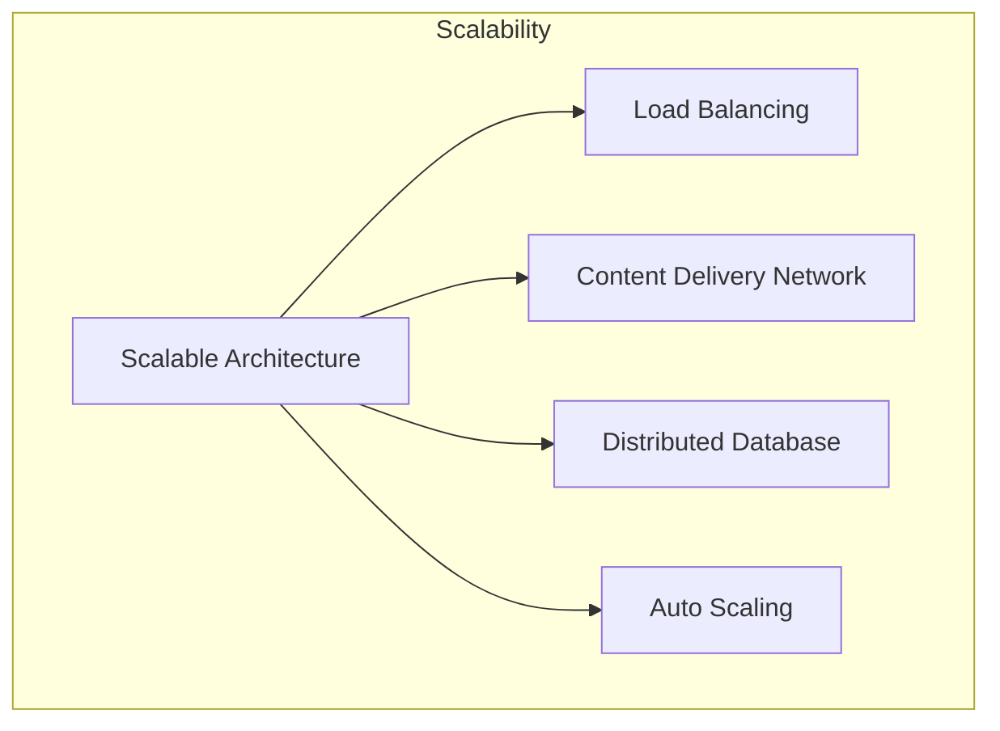
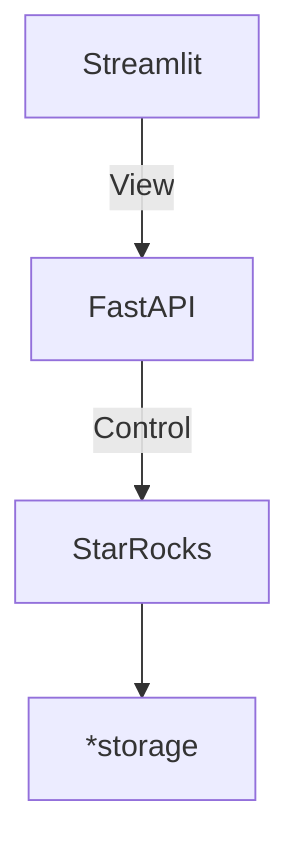
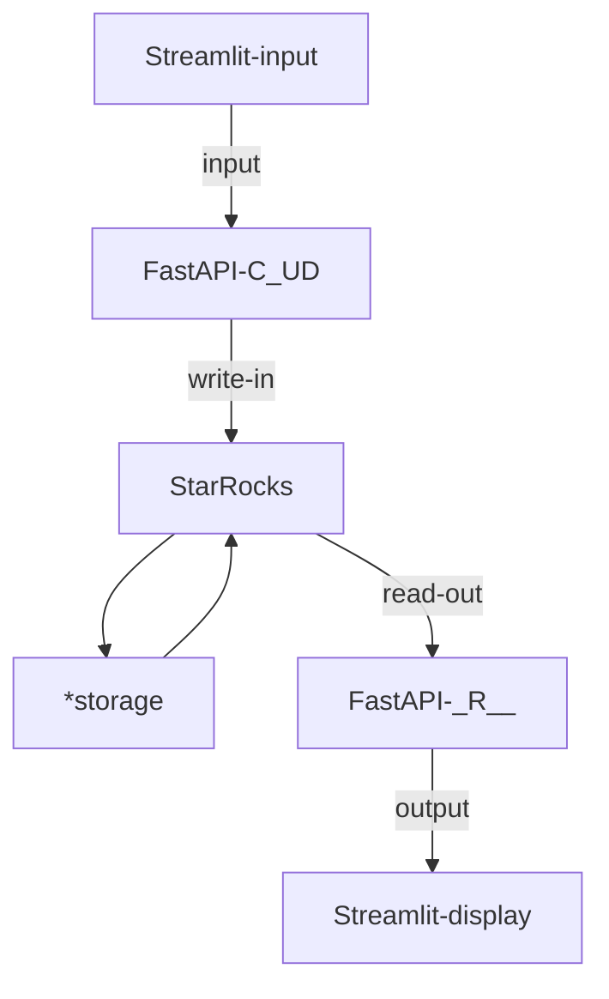

# LitePolis
Infrastructure for E-democracy  
 

Polis is a real-time system for gathering, analyzing and understanding
what large groups of people think in their own words,
enabled by advanced statistics and machine learning.

LitePolis is a Python-based, developer-friendly iteration of [Polis](https://github.com/compdemocracy/polis),
designed to provide a scalable and flexible platform for data scientists and developers.
Our goal is to make it easy to build and deploy data-driven applications giving more flexibility to the community.

## Overview

LitePolis is a modular Python-based system, refactored from [Polis](https://github.com/compdemocracy/polis), designed for scalability and performance.  It uses a microservice-like architecture for flexibility and integration. This repository acts as the central package manager, orchestrating the integration of various components for deployment.  The package manager automatically discovers and manages routers (APIs), middleware, and UI packages, including dependency resolution. Database interactions are handled as a router (API). Future development will include Docker SDK support for managing dependencies like database servers.

Routers and middleware can be developed independently in separate repositories and integrated during deployment based on the dependencies declared by UI packages.  This allows for a highly modular and extensible system.

**Routers, UI Packages, and Middlewares**

In LitePolis, these components play distinct roles, though their relationship to traditional MVC might not be a direct mapping due to the distributed nature of the system:

* **Routers (APIs):** These are analogous to *Controllers* in a traditional MVC framework. They define the endpoints and logic for handling incoming requests and returning responses.  They act as the entry point for all interactions with the system.  A database interaction is handled *through* a router, meaning a dedicated router is responsible for communicating with the database. The database itself, along with the data processing logic, represents the *Model* in this context.

* **UI Packages:** These are closer to the *View* component of MVC. They consume the APIs exposed by the routers to present data and interact with the user.  While they might contain some control logic, their primary function is to render the user interface and handle user interactions.  They then communicate these interactions back to the routers.

* **Middlewares:** These components sit between the routers and the UI, acting as intermediaries. They handle cross-cutting concerns like authentication, authorization, logging, and rate limiting.  They are not directly tied to the MVC paradigm but are essential for managing access control, security, and other system-wide functionalities.  Thinking of them as handling access control is a reasonable simplification.

**Scalability and Infrastructure**

LitePolis is designed for scalability and can handle high-volume usage through horizontal scaling:

* **Routers/APIs (Controllers):**  Multiple instances of the API servers can be deployed and managed by a load balancer to distribute traffic and ensure high availability. LitePolis support autoscaling on cloud platforms like Google Cloud out-of-box.
* **UI Packages (Views):**  Static files for the UI can be served from a content delivery network (CDN) to minimize latency and improve performance. The UI itself can be designed to be stateless, allowing for easy horizontal scaling of the application servers.
* **Model (Database and Data Processing):**  LitePolis leverages distributed databases and data processing systems (like [StarRocks on Kubernetes](https://github.com/StarRocks/starrocks-kubernetes-operator/tree/main/examples/starrocks)) that can scale horizontally to handle increasing data volumes and query loads.

This distributed architecture, combined with cloud infrastructure and autoscaling, allows LitePolis to adapt to varying levels of demand and maintain performance even under heavy load, enabling nation-wide high-volume usage.

## Conclusion

This flexible architecture, coupled with a central package manager, simplifies the development process.  Developers can focus on building their applications (routers, middleware, UI) while LitePolis handles the underlying infrastructure for scalability and performance.  This separation of concerns allows for rapid development and deployment of new features and functionalities.

# TODOs
## Features

* [ ] **Real-time Sentiment Gathering:** Polis gathers and analyzes opinions from large groups of people in real-time.
* [ ] **Open-Ended Feedback:** Participants can express their views in their own words, going beyond simple surveys or polls.
* [ ] **Anonymous Participation:** Participants can contribute anonymously, fostering open and honest dialogue.
* [ ] **Voting Mechanism:** Participants can vote on statements submitted by others, indicating agreement, disagreement, or neutrality.
* [ ] **Advanced Statistical Analysis:** Polis uses machine learning algorithms to identify consensus statements, divisive statements, and patterns in opinions.
* [ ] **Data Visualization and Reporting:** The platform provides real-time data visualization and reporting tools to understand the results of the conversation.
* [ ] **Moderation Tools:** Moderators can manage the conversation, address spam, and ensure a productive environment.
* [ ] **Scalability:** The platform can handle large-scale conversations with many participants.

**Core Functionality:**

* **User Interface:**
    * [ ] User registration and authentication.
    * [ ] Interface for creating and joining conversations.
    * [ ] Interface for submitting statements and voting on them.
    * [ ] Interface for viewing conversation data and reports.
    * [ ] User-friendly and intuitive design.
* **Backend System:**
    * [ ] Database to store user data, conversation data, and voting data.
    * [x] API for interacting with the frontend and other services.
    * [ ] Secure and reliable infrastructure.
    * [x] Scalable architecture to handle large volumes of data and users.
* **Machine Learning Algorithms:**
    * [ ] Algorithms to analyze sentiment and identify consensus and divisive statements.
    * [ ] Algorithms to personalize the user experience based on their voting history and interests.
    * [ ] Algorithms to detect spam and inappropriate content.
* **Data Visualization and Reporting:**
    * [ ] Real-time visualizations of conversation data, including sentiment trends, agreement maps, and key statements.
    * [ ] Customizable reports and dashboards for analyzing data.
    * [ ] Ability to export data in various formats.
* **Moderation Tools:**
    * [ ] Tools for managing user accounts and roles.
    * [ ] Tools for flagging and removing inappropriate content.
    * [ ] Tools for moderating discussions and resolving conflicts.
* **Integration with Third-Party Services:**
    * [ ] Integration with translation services for multilingual conversations.
    * [ ] Integration with spam filtering services to prevent abuse.
    * [ ] Integration with other platforms and tools for data analysis and visualization.
* **Security:**
    * [ ] Compliance with relevant privacy regulations (e.g., GDPR).
* **Scalability:**
    * [x] Ability to handle large numbers of users and conversations.
    * [x] Scalable infrastructure to accommodate increasing demand.
    * [ ] Performance optimization for efficient data processing.
* **Accessibility:**
    * [ ] Accessible design for users with disabilities.
    * [ ] Support for multiple languages and cultural contexts.
* **Documentation:**
    * [ ] Comprehensive documentation for developers and users.
    * [ ] Tutorials and guides to help users understand the platform.
* **Testing:**
    * [ ] Thorough testing of all features and functionality.
    * [x] Automated testing to ensure code quality and stability.

## Getting started
Under development...
<!-- something about deployment and configuration -->
### Tryout
use all in one dockerfile
## Advanced usage
### Separate storage
https://www.starrocks.io/blog/four-simple-ways-to-deploy-starrocks
### Separate front end
disable `streamlit`
develop your own front end web/mobile/desktop application with RESTful API docs
### Product deployment
- MVC architecture
- Data lakehouse
  - https://www.starrocks.io/blog/four-simple-ways-to-deploy-starrocks
- scaling
  - scaling of UI
  - scaling of API server
  - scaling of database

## Developer manual
### Tech stack
Relationship of containers

Data flows from UI to API and store in database
then been accessed by other UI widget through other API endpoints

*storage: Such as Amazon S3, Google Cloud Storage, Azure Blob Storage, and other S3-compatible storage