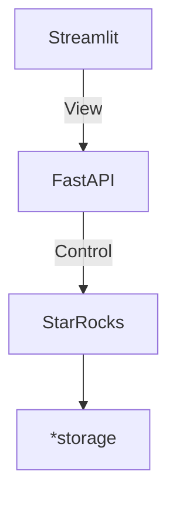
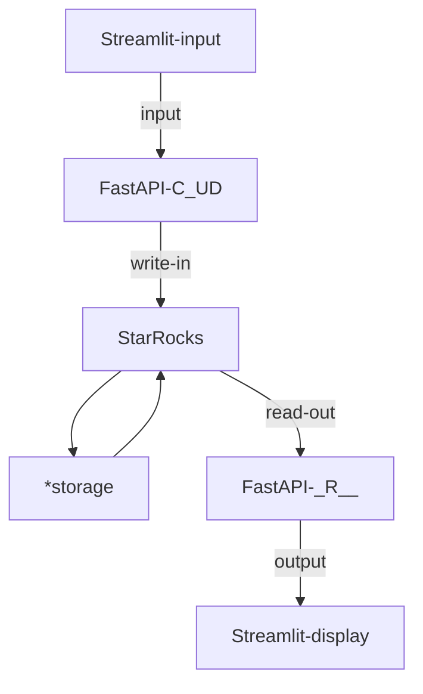

# Server-side
Relationship of containers

Data flows from UI to API and store in database
then been accessed by other UI widget through other API endpoints

> *storage: Such as Amazon S3, Google Cloud Storage, Azure Blob Storage, and other S3-compatible storage

# Related documents
- [Detail in API design](api/)
- The APIs implemented CRUD of [database implementation](database.md)

Access control is provided by `Streamlit-Authenticator`
> The flow and vulnerability is that streamlit need to refer to YAML instead of database query,
> this is a heavy IO task if dumping the table everytime someone login.
> And a risk of exploiting the API dumping YAML will get all credentials in server.
